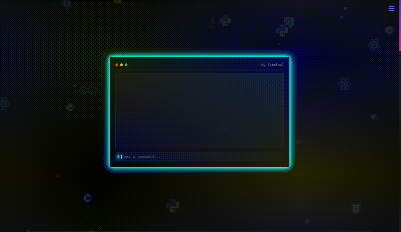

# 👋 Welcome to My Repository!

I’m a computer science student with a passion for solving problems and building meaningful solutions. This repository is a reflection of my journey through various domains of tech, including:

- 🖥️ **Frontend Development**: Crafting user-friendly interfaces.  
- ⚙️ **Backend Development**: Designing robust server-side applications.  
- 📂 **Operating Systems**: Exploring how systems work under the hood.  
- 🤖 **Artificial Intelligence**: Experimenting with machine learning and intelligent solutions.  
- 🔧 **Hardware Design**: Creating and simulating custom CPU architectures.  
- 🛠️ **Embedded Systems**: Exploring microcontrollers and building real-world IoT solutions.

## 🌐 Explore My Work

✨ **Check out my portfolio website:** [Visit My Portfolio](https://singular-treacle-46a976.netlify.app/#contacts)  

Here, you’ll find:  
- 🌟 A showcase of my skills and projects.  
- 📄 My resume and achievements.  
- 📬 Contact details to connect with me.  

## 💡 Why This Repository?  
This repository serves as my digital workspace where I document my projects, share ideas, and explore new technologies. It’s a place where you’ll find:  
- Code that highlights my skills in hardware design, web development, OS basics, and AI.  
- Personal projects I’ve worked on to challenge myself and learn.  
- Future experiments as I continue to explore and grow as a developer.  

## 📫 Let’s Connect!  
- 🌐   
- 🔗   
- 💻   

Feel free to connect or collaborate—let’s build something great together!  
